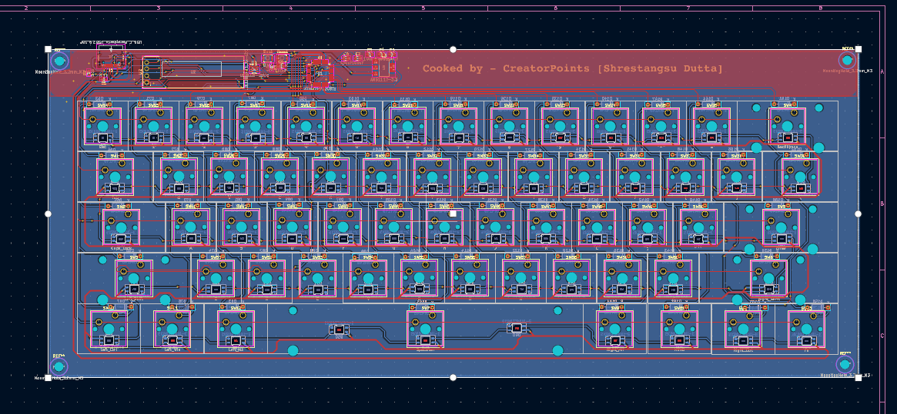

# Tachi Ninja V2
A 60% Silent Linear mechanical keyboard that has per key RGB lighting and a display for pure asthetics! Made so that I can advance more in this fun cad pathway! [Now Hot-Swappable!]

---

## What was fun to make and what wasnt:
Well, it was overall a great project, I liked the most is the designing the pcb and making the case of this keyboard. But the ABSOLUTE brutal part was manually tracing all 424 pads :skull:

---

## Why did I make this?
I made it because I wanted a actually good keyboard, so instead of buying from online I decided to make my own. Advantages are I get to control how it would be and ofcource the flex :cool:

---

## Whats this "V2" Thingy?
So, when this project was submitted for forge, the reviewer returned the project for multiple reasons, one of it being incomplete PCBA, so, I improvised with something much better. The table would be the best:
|V1|V2|
|--|--|
|Permanent MX Switches|Kailh MX Hot Swappable sockets|
|Very crampy keycaps|Follows universal 19.05mm rule for keyboards|
|More compact, less polished|Kinda less compact, more polished|

## Components used:
The following stuffs were used... Very hacky :)
- STM32F072C8Tx
- 1N4148 (x61)
- Kailh MX Hot Swappable Sockets (x61)
- SK6812MINI-E (x63)
- Resistors (x3)
- Capacitors (x6)
- Smol Switches (x2) - For boot & NRST purposes
- USB C 2.0 Receptable 16P
- AMS1117-3.3V
- 0.91 Inch I2C OLED Screen
- USBLC6-2SC6

---
## BOM:
|Item|Link|Price|Shipping Cost|
|----|----|-----|-------------|
|Switch|[HMX Taro Silent Linear](https://stackskb.com/store/hmx-taro-silent-linear-switch-pack-of-10/)|₹2,625.00 / $27.39|Free|
|Stabilizers|[Keyboard Stabilizers](https://stackskb.com/store/durock-clear-screw-in-stabilizers-v2/?attribute_combination=4%2B1+Set&attribute_spacebar-size=6.25U)|₹1,595.00 / $16.65|Free|
|Solder|[Lead free solder](https://www.amazon.in/SCHOFIC-Solder-Sn99-Ag0-3-Cu0-7-Weight-0-22lb/dp/B078C7SMKY/ref=sr_1_10?sr=8-10)|₹385 / $4.02|Free|
|PCB|[JLCPCB PCBA](HTTPS://jlcpcb.com)|$190.29|$72.45|

Total - $310.80
### I would recommend to see this for more detail:
[BOM](BOM.md)

---
## Images!

wait, This is 

