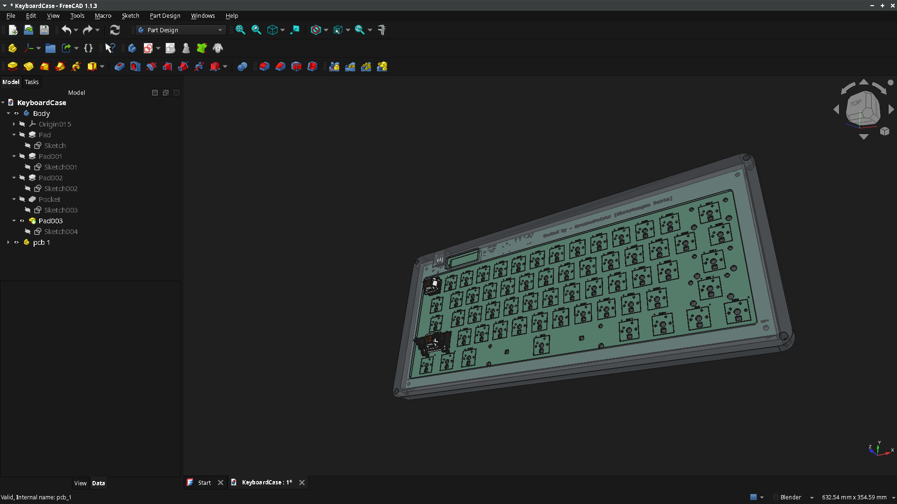

# Tachi-Ninja
A 60% Silent Linear mechanical keyboard that has per key RGB lighting and a display for pure asthetics! Made so that I can advance more in this fun cad pathway!

---

## What was fun to make and what wasnt:
Well, it was overall a great project, I liked the most is the designing the pcb and making the case of this keyboard. But the ABSOLUTE brutal part was manually tracing all 424 pads :skull:

---

## Why did I make this?
I made it because I wanted a actually good keyboard, so instead of buying from online I decided to make my own. Advantages are I get to control how it would be and ofcource the flex :cool:

---

## Components used:
The following stuffs were used... Very hacky :)
- STM32F072C8Tx
- 1N4148 (x61)
- Cherry MX Switches (x61)
- SK6812MINI-E (x63)
- Resistors (x3)
- Capacitors (x6)
- Smol Switches (x2) - For boot purposes
- USB C 2.0 Receptable 16P
- AMS1117-3.3V
- 0.91 Inch I2C OLED Screen
- USBLC6-2SC6

---
## BOM:
|Item|Link|Price|Shipping Cost|
|----|----|-----|-------------|
|Switch|[HMX Taro Silent Linear](https://stackskb.com/store/hmx-taro-silent-linear-switch-pack-of-10/)|₹2,625.00 / $27.39|Free|
|PCB|[JLCPCB PCBA](HTTPS://jlcpcb.com)|$190.29|$72.45|

Total - $290.13

---
## Images!

